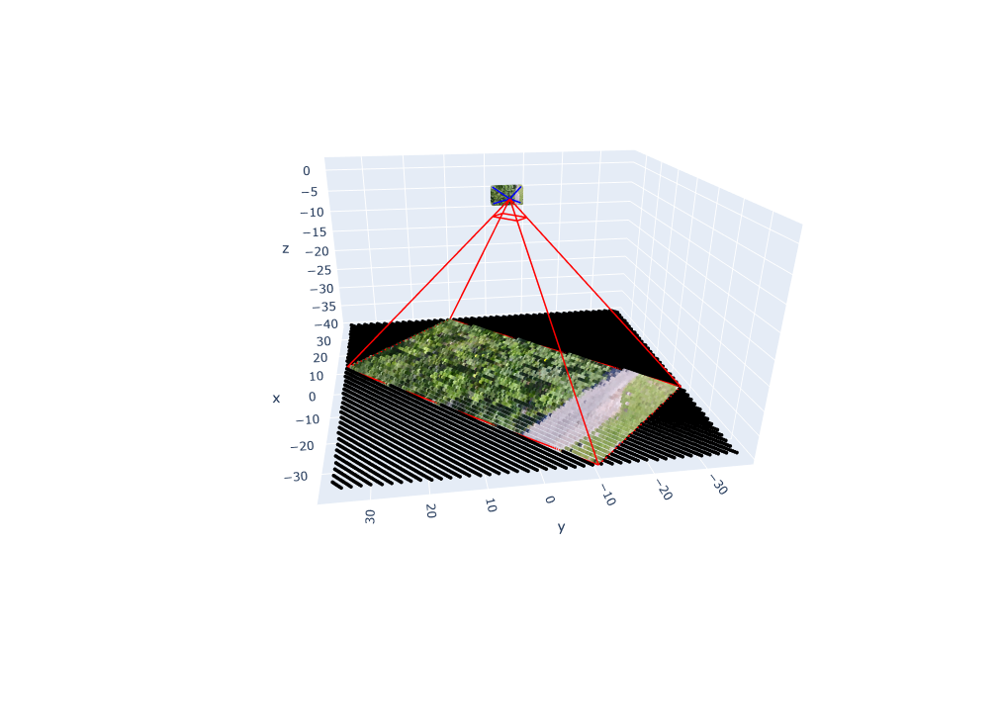
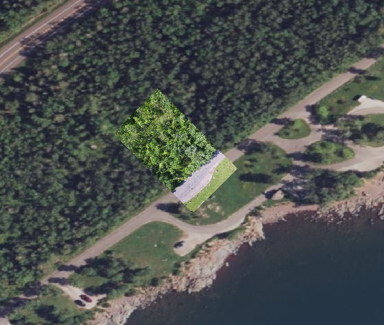

# DJI UAV image correction

This project correcting images through DJI UAV image metadata.



By reading the image metadata, a photographic model is established and the image is projected onto the ground.



# How to use:

1. Make sure you have a python3.10 environment.

2. Installation environment
   
   ```
   pip install -r requirements.txt
   ```

3. Run script
   
   ```
   python main.py --input_image path/of/image.JPG --output_folder output/folder --pixl_size 3.3 --show_3D_model False
   
   --input_image: Image file or folder
   --output_folder: Output image folder
   --pixl_size: Sensor pixel size, in microns (optional parameter, default is 3.3).
   --show_3D_model: Whether to display 3D model (optional parameter, default is False)
   ```

# You can find some test UAV image here：

[pierotofy/drone_dataset_brighton_beach](https://github.com/pierotofy/drone_dataset_brighton_beach/tree/master)


